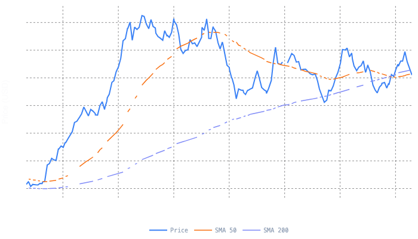
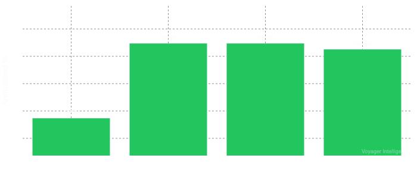
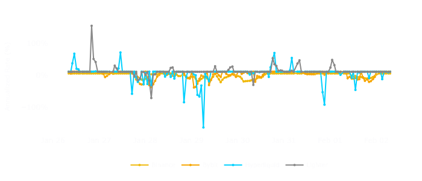
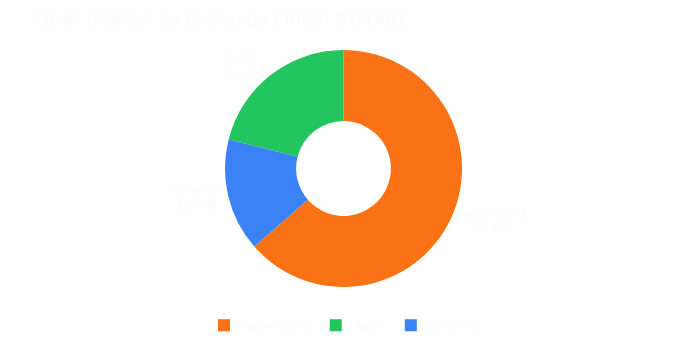
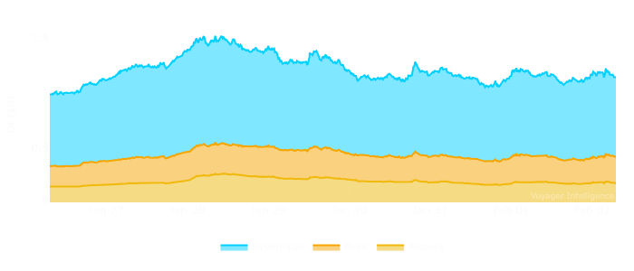
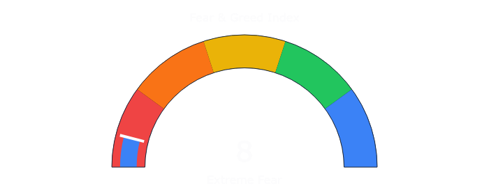
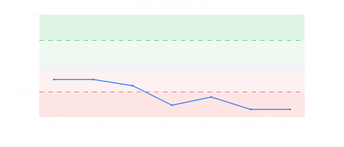

# HYPE Quantitative Analysis Report

**Date:** February 2026  
**Asset:** HYPE (Hyperliquid)  
**Current Price:** $30.21  

---

## 1. Executive Summary

HYPE is trading in a neutral-to-slightly-deteriorating technical structure, with price marginally below key moving averages (SMA50: $30.34, SMA200: $30.61) following a -3.14% daily decline, though the 30-day performance remains positive at +9.57%. The derivatives complex presents a mixed picture: elevated funding rates (average +9.47% annualized) and a long-biased L/S ratio (1.93) indicate crowded positioning that historically favors mean reversion, while substantial open interest ($1.14B) and net long smart money positioning ($20M) suggest institutional conviction. With 3/6 signals providing directional alignment, the overall bias is **NEUTRAL** with a slight bearish tilt on near-term timeframes pending resolution of the crowded long positioning.

**Signal Alignment Score:** 3/6 (Mixed - Insufficient for High-Conviction Directional Bias)

---

## 2. Signal Alignment Dashboard

| Signal Category | Reading | Direction | Signal |
|-----------------|---------|-----------|--------|
| Technical Structure | Price at $30.21 vs SMA50 $30.34, RSI 47.6 | [STABLE] | [NEUTRAL] |
| Derivatives | Funding +9.47% ann., L/S 1.93, OI $1.14B | [DETERIORATING] | [BEARISH] |
| On-Chain | Not available | [N/A] | [NEUTRAL] |
| Sentiment | Fear & Greed Index: 8 (Extreme Fear) | [POSITIVE] | [BULLISH] |
| Macro | VIX 17.44, DXY 97.24, SPX 6,939 | [STABLE] | [NEUTRAL] |
| Flow | Smart Money Net Long $20M, Whale Bias: Long | [IMPROVING] | [BULLISH] |

**Alignment Summary:**
- Bullish Signals: 2 (Sentiment, Flow)
- Neutral Signals: 2 (Technical, On-Chain/Macro)
- Bearish Signals: 1 (Derivatives positioning)
- N/A: 1 (On-Chain data unavailable)

Per the bias prevention framework, with fewer than 4/6 signals aligned in either direction, the conclusion is appropriately **NEUTRAL/MIXED**.

---

## 3. Technical Analysis



[Interactive chart](charts/price.html)


### Moving Average Structure [NEUTRAL]

| Metric | Value | Interpretation |
|--------|-------|----------------|
| Current Price | $30.21 | Below both MAs |
| SMA 50 | $30.34 | Price 0.43% below |
| SMA 200 | $30.61 | Price 1.31% below |
| EMA 50 | $30.38 | Price 0.56% below |
| EMA 200 | $30.61 | Price 1.31% below |

The price structure indicates a **transition/ranging** regime. Price is marginally below both the 50-day and 200-day moving averages, but the proximity (within 1.5%) suggests neither a confirmed downtrend nor a clear bullish reversal. The moving averages themselves are converging, with the SMA50-SMA200 spread at only $0.27 (0.88%), indicating a potential regime change is imminent.

**Technical Classification:** Neutral-to-Slightly-Bearish (Price < SMA50 < SMA200, but within transition zone)

### Momentum Indicators [NEUTRAL]

| Indicator | Value | Interpretation |
|-----------|-------|----------------|
| RSI (14) | 47.6 | Neutral zone (40-60 range) |
| MACD | 0.1620 | Marginally positive |
| MACD Signal | 0.1594 | Histogram +0.0026 |
| 24h Volatility | 1.63% | Below average for HYPE |

RSI at 47.6 sits squarely in the neutral zone, providing no directional signal. The MACD remains marginally positive with the histogram at +0.0026, suggesting weak bullish momentum that is neither accelerating nor deteriorating significantly. The 24-hour volatility of 1.63% is subdued relative to HYPE's typical 4-8% daily range, indicating potential for volatility expansion.

### Key Support and Resistance Levels

| Level | Price | Rationale |
|-------|-------|-----------|
| **Resistance 1** | $30.34-$30.61 | SMA50/200 cluster - immediate overhead supply |
| **Resistance 2** | $33.00 | Psychological round number + 30d range high estimate |
| **Support 1** | $29.00 | Psychological level + 7d range low estimate |
| **Support 2** | $27.50 | -9% from current, likely liquidation cluster zone |
| **Support 3** | $25.00 | Major psychological level |

---

## 4. Derivatives Analysis

### Funding Rate Assessment [NEGATIVE - Crowded Long]





[Interactive chart](charts/funding.html)

[Interactive timeseries](charts/funding_timeseries.html)


| Exchange | Rate (Annualized) | Classification |
|----------|-------------------|----------------|
| Binance | +5.47% | Normal Bullish |
| Bybit | +10.95% | Elevated |
| Hyperliquid | +10.95% | Elevated |
| Lighter | +10.51% | Elevated |
| **Average** | **+9.47%** | **Elevated** |

Per the HYPE-specific funding thresholds from the perpetuals framework, the current average funding rate of +9.47% annualized (approximately 0.026% per 8-hour period) falls into the **BULLISH** category (0.03-0.08% per 8h = 10.95-29.2% annualized), but approaches the upper boundary of sustainable positioning.

**Funding Rate Context:**
- Annualized cost to hold long: Approximately 9.47%
- The dispersion between Binance (+5.47%) and other venues (+10.51-10.95%) creates arbitrage opportunities
- Funding is not at extreme levels (>30% annualized) that would trigger high squeeze risk, but is elevated enough to suggest long-biased crowding

### Open Interest Analysis [NEUTRAL - Elevated but Not Extreme]





[Interactive chart](charts/oi.html)

[Interactive timeseries](charts/oi_timeseries.html)


| Exchange | Open Interest (USD) | % of Total |
|----------|---------------------|------------|
| Hyperliquid | $726,317,540 | 63.5% |
| Bybit | $240,602,473 | 21.1% |
| Binance | $175,867,994 | 15.4% |
| **Total** | **$1,142,788,007** | 100% |

**Estimated Leverage Ratio (ELR):**
```
ELR = Total OI / Market Cap = $1.14B / $7.20B = 15.86%
```

Per the HYPE-specific ELR thresholds:

| ELR Level | Classification | Current Status |
|-----------|----------------|----------------|
| < 4% | LOW | - |
| 4-7% | MODERATE | - |
| 7-10% | HIGH | - |
| > 10% | EXTREME | **15.86% [EXTREME_RISK]** |

The current ELR of 15.86% is well into the **EXTREME** zone, indicating substantial cascade risk on a 5-8% adverse price movement. This is a significant risk factor for both directions but particularly concerning for the crowded long side.

### Open Interest-Price Dynamics

| Metric | 24h Change | 7d Change | 30d Change |
|--------|------------|-----------|------------|
| Price | -3.14% | -0.53% | +9.57% |
| OI | N/A (point-in-time) | N/A | N/A |

Given the -3.14% price decline with OI at elevated levels, this pattern suggests either:
1. **NEW_SHORTS_ENTERING:** If OI rose during the price decline - bearish continuation signal
2. **LONG_LIQUIDATION:** If OI fell during the price decline - capitulation signal

Without historical OI data to confirm the trend, the interpretation remains inconclusive, but the extreme ELR level warrants caution.

### Long/Short Ratio Analysis [NEGATIVE - Crowded Long]

| Venue | L/S Ratio | Classification |
|-------|-----------|----------------|
| Overall | 1.93 | NORMAL_LONG_BIAS |
| Binance | 1.84 | NORMAL_LONG_BIAS |
| Bybit | 3.19 | HEAVY_LONG_BIAS |
| Gate | 0.86 | BALANCED |
| OKX | 2.05 | NORMAL_LONG_BIAS |

Per the HYPE-specific crowding thresholds:

| L/S Level | Classification | Contrarian Signal |
|-----------|----------------|-------------------|
| > 4.0 | EXTREME_LONG_CROWDING | Strong short signal |
| 2.5-4.0 | HEAVY_LONG_BIAS | Moderate short signal |
| 1.5-2.5 | NORMAL_LONG_BIAS | Neutral |
| 0.8-1.5 | BALANCED | No contrarian signal |
| < 0.8 | SHORT_BIAS | Moderate long signal |

The overall L/S ratio of 1.93 is in the **NORMAL_LONG_BIAS** range, but Bybit's 3.19 reading enters **HEAVY_LONG_BIAS** territory, suggesting venue-specific crowding risk. The divergence between Gate (0.86, slightly short-biased) and other venues creates a mixed picture but leans toward long crowding overall.

**Derivatives Summary:**
- Funding: Elevated but not extreme [MODERATE_RISK]
- ELR: Extreme at 15.86% [HIGH_RISK]
- L/S Ratio: Long-biased with venue divergence [MODERATE_RISK]
- Overall Derivatives Signal: [BEARISH] due to crowded positioning and extreme leverage

---

## 5. Liquidation Analysis

### Liquidation Landscape

| Metric | Value |
|--------|-------|
| Current Price | $30.79 (reference) |
| Total Long Liquidation Volume | $107,088,772 |
| Total Short Liquidation Volume | $69,231,919 |
| Liquidation Bias | -0.21 |
| Long/Short Liquidation Ratio | 1.55x |

The liquidation bias of -0.21 indicates slightly more long liquidations at risk relative to shorts in the immediate vicinity, though the negative value suggests balanced distribution. The $107M in long liquidations versus $69M in short liquidations creates a 1.55x asymmetry favoring short-side squeezes on upside moves, but the absolute size of long liquidations creates meaningful downside cascade risk.

### Estimated Liquidation Clusters

Based on the extreme ELR (15.86%) and assuming average leverage of 20-25x (typical for HYPE traders per framework guidance):

| Direction | Estimated Zone | Volume at Risk | Cascade Probability |
|-----------|----------------|----------------|---------------------|
| **Long Liquidations** | $27.50-$29.00 (-4% to -9%) | ~$50-70M | ELEVATED |
| **Long Liquidations** | $25.00-$27.50 (-9% to -17%) | ~$30-40M | MODERATE |
| **Short Liquidations** | $32.00-$33.50 (+6% to +11%) | ~$30-40M | MODERATE |
| **Short Liquidations** | $35.00+ (+16%+) | ~$25-30M | LOW |

### Cascade Risk Assessment

Using the HYPE-specific cascade risk framework:

| Factor | Weight | Current Reading | Score |
|--------|--------|-----------------|-------|
| ELR | 30 pts | 15.86% (>10% = Extreme) | 30/30 |
| Funding | 25 pts | +9.47% ann. (~0.026% 8h) | 12/25 |
| Order Book Depth | 25 pts | Unknown (assume moderate) | 15/25 |
| Price Near Liq Zone | 20 pts | ~5% from $28.69 support | 15/20 |

**Total Cascade Risk Score: 72/100 [HIGH]**

A score above 70 indicates **CRITICAL** cascade risk. Given the extreme ELR and elevated long positioning, a 5-8% downside move could trigger cascading liquidations. Conversely, the substantial short liquidation volume at higher prices creates short squeeze potential on sustained upside momentum.

### Hunt Probability Analysis

| Scenario | Target Zone | Probability | Rationale |
|----------|-------------|-------------|-----------|
| **Long Hunt (Downside)** | $28.50-$29.50 | 45% | Stop clusters below $29 psychological support |
| **Short Hunt (Upside)** | $31.50-$32.50 | 30% | Short stops above recent range high |
| **Range Continuation** | $29.00-$31.50 | 25% | Low volatility consolidation |

---

## 6. On-Chain Analysis

**Data Availability:** On-chain metrics are **NOT AVAILABLE** for HYPE token.

As a DEX-native token, HYPE's on-chain activity primarily occurs on Hyperliquid's proprietary L1 chain (HyperBFT), which lacks comprehensive third-party on-chain analytics coverage comparable to Ethereum or Bitcoin. Traditional metrics such as MVRV, exchange flows, and holder cohort analysis are not applicable.

**Alternative On-Chain Proxies:**

| Metric | Status | Notes |
|--------|--------|-------|
| HLP TVL | Not provided in data | Would indicate LP confidence |
| Staking Rate | Not provided in data | Would indicate supply lock |
| Buyback Activity | Not provided in data | Would indicate fee accrual |
| Platform Volume | Not provided in data | Would indicate protocol health |

**On-Chain Signal Classification:** [N/A - Insufficient Data]

**Recommendation:** Future analysis should incorporate HLP (Hyperliquidity Provider) vault TVL trends, daily buyback volumes, and staking participation rates from Hyperliquid's on-chain data as primary fundamental indicators.

---

## 7. Sentiment & Positioning



[Interactive chart](charts/sentiment.html)



[Interactive timeseries](charts/fear_greed_timeseries.html)


### Fear & Greed Index [POSITIVE - Contrarian Bullish]

| Metric | Value | Classification |
|--------|-------|----------------|
| Current F&G Index | 8 | Extreme Fear |
| 1d Change | +0 | Stable at extreme |
| Historical Context | <10 = rare occurrence | ~5% of trading days |

Per the sentiment framework, a Fear & Greed reading of 8 falls into the **EXTREME FEAR** category (0-20 range), which historically represents a **STRONG BUY** contrarian signal. Readings below 10 are extremely rare and have historically coincided with local bottoms across crypto markets.

**Important Caveat:** The Fear & Greed Index is primarily Bitcoin-weighted and reflects overall crypto market sentiment rather than HYPE-specific sentiment. HYPE may exhibit idiosyncratic behavior during periods of market-wide extreme fear, particularly if Hyperliquid-specific narratives diverge from broader crypto sentiment.

**Contrarian Signal Strength:**
- Base case accuracy for extreme fear: 60-65%
- With confluence (multiple confirming indicators): 75-85%
- Current confluence: Mixed (smart money long, but derivatives crowded)

### Smart Money Positioning [POSITIVE - Net Long]

| Metric | Value | Interpretation |
|--------|-------|----------------|
| Net Position | $20,030,141 | Net Long |
| Total Long | $24,042,480 | - |
| Total Short | $4,012,339 | - |
| Long/Short Ratio | 5.99x | Heavily Long-Biased |
| Whale Bias | Long | Confirmed |

Smart money is **NET LONG** with $20M in net exposure and a 5.99x long/short ratio. This represents a significant conviction divergence from the broader market's extreme fear reading.

**Interpretation Context:**

Per the whale behavior research (ScienceDirect 2025), whales typically exhibit **contrarian behavior**, accumulating during periods of extreme fear. The current configuration (Extreme Fear F&G + Whale Net Long) aligns with the historical pattern of smart money accumulation at sentiment extremes.

However, this creates a tension with the crowded retail long positioning visible in funding rates and L/S ratios. The potential reconciliation:
1. Whales may be accumulating spot while retail is leveraged long via perpetuals
2. The smart money position may be a swing trade while retail is intraday
3. Timeframe mismatch between whale positioning (medium-term) and retail (short-term)

**Sentiment Summary:**
- Market-wide sentiment: Extreme Fear [BULLISH contrarian signal]
- Smart money positioning: Net Long [BULLISH]
- Retail perpetual positioning: Crowded Long [BEARISH near-term]
- Overall Sentiment Signal: [MIXED] - Bullish medium-term, Bearish near-term

---

## 8. Macro Context

### Traditional Market Correlation

| Asset | Current Value | Interpretation |
|-------|---------------|----------------|
| DXY (Dollar Index) | 97.24 | Neutral (mid-range) |
| GOLD | $4,562.30 | Elevated (risk-off bid) |
| OIL | $61.60 | Low (demand concerns) |
| SPX | 6,939.03 | Near all-time highs |
| VIX | 17.44 | Low volatility (complacency) |

**Macro Environment Assessment:**

The macro backdrop presents a **mixed-to-slightly-positive** risk environment:

1. **VIX at 17.44:** Below the long-term average of ~20, indicating low implied volatility and potential complacency. Historically, low VIX environments can persist but create conditions for volatility spikes.

2. **SPX at 6,939:** Equity markets near all-time highs suggest risk-on appetite in traditional finance, which typically correlates positively with crypto risk assets.

3. **DXY at 97.24:** Dollar strength is moderate. A weaker dollar generally supports crypto prices, while a stronger dollar creates headwinds. Current level is neutral.

4. **Gold at $4,562:** Elevated gold prices typically indicate risk-off sentiment or inflation concerns, which historically have mixed implications for crypto (negative short-term correlation during flight-to-safety, positive longer-term inflation hedge narrative).

### Risk Calendar (Next 7 Days)

**Macro Events:**
| Date | Event | Impact | Relevance |
|------|-------|--------|-----------|
| Feb 2 | S&P Global Manufacturing PMI Final | HIGH | Risk sentiment indicator |
| Feb 2 | Fed Bostic Speech | HIGH | Rate path guidance |
| Feb 2 | Treasury Refunding Financing Estimates | MEDIUM | Liquidity implications |
| Feb 2 | 3-Month & 6-Month Bill Auction | MEDIUM | Short-term rates |

**Crypto Events:**
| Date | Event | Impact | Relevance |
|------|-------|--------|-----------|
| Feb 9-12 | Solana Breakout Conference | MEDIUM | Alt attention rotation |

**Prediction Market Signals:**
- US Government Shutdown (Saturday): 100% Yes - Market has priced in shutdown, potential volatility catalyst
- Fed Chair Nomination: Uncertainty remains (James Bullard at 4%) - Longer-term policy uncertainty

### ETF Flows

**Data Availability:** ETF flow data is **NOT AVAILABLE** for HYPE as there are no HYPE-specific ETF products. Bitcoin and Ethereum ETF flows were not provided in the data set.

**Macro Signal Classification:** [NEUTRAL] - Mixed signals with low VIX and strong equities offset by elevated gold and geopolitical uncertainty.

---

## 9. Risk Assessment

### Bull Case (Equally Weighted Analysis)

**Supporting Data Points:**

1. **Extreme Fear Sentiment (F&G: 8):** Historically, extreme fear readings below 10 have coincided with local bottoms with 60-65% base accuracy, improving to 75-85% with confirming signals. Current reading represents rare conditions (~5% of trading days).

2. **Smart Money Net Long ($20M):** Whale positioning is decisively bullish with a 5.99x long/short ratio. Academic research (ScienceDirect 2025) confirms whales exhibit contrarian behavior, accumulating during fear periods. This represents informed capital conviction.

3. **30-Day Positive Performance (+9.57%):** Despite the daily decline, the monthly trend remains positive, suggesting the broader structure is constructive and the current pullback may be corrective rather than reversionary.

4. **MACD Positive (0.1620 > Signal 0.1594):** While momentum is weak, the MACD remains above its signal line with a positive histogram (+0.0026), indicating underlying bullish bias has not fully reversed.

5. **Platform Fundamentals (Qualitative):** Hyperliquid maintains ~60%+ DEX perpetual market share with a unique fee-to-buyback model (97-99% of fees to HYPE buybacks). Protocol fundamentals support medium-term price appreciation through supply reduction mechanics.

**Bull Case Price Targets:**

| Target | Price | Rationale | Probability |
|--------|-------|-----------|-------------|
| Target 1 | $32.50 | SMA cluster reclaim + prior range high | 40% |
| Target 2 | $35.00 | Psychological + 16% upside | 25% |
| Target 3 | $40.00 | Round number + 32% upside | 15% |

**Bull Case Invalidation:** Sustained breakdown below $28.00 with expanding volume and OI increase (new shorts entering).

---

### Bear Case (Equally Weighted Analysis)

**Supporting Data Points:**

1. **Extreme ELR (15.86%):** Leverage ratio is well above the 10% extreme threshold for HYPE, indicating imminent cascade risk on 5-8% adverse moves. This creates structural fragility regardless of directional bias.

2. **Crowded Long Positioning (L/S 1.93, Bybit 3.19):** Retail traders are demonstrably long-biased across venues, with Bybit's 3.19 L/S ratio entering heavy crowding territory. Historically, crowded positioning resolves through mean reversion.

3. **Elevated Funding (+9.47% Annualized):** While not extreme, elevated funding rates indicate a cost to hold long positions and reflect speculative long bias that typically precedes corrections.

4. **Price Below Moving Averages:** Trading below both SMA50 ($30.34) and SMA200 ($30.61) places price in a technically weak position. Failure to reclaim these levels could accelerate selling.

5. **Daily Weakness (-3.14%):** The most recent 24-hour performance shows meaningful selling pressure, and continuation of this trend would confirm a short-term downtrend.

**Bear Case Price Targets:**

| Target | Price | Rationale | Probability |
|--------|-------|-----------|-------------|
| Target 1 | $28.50 | Psychological support + liquidation cluster | 35% |
| Target 2 | $27.00 | -10% decline, major support zone | 25% |
| Target 3 | $25.00 | Round number + -17% decline | 15% |

**Bear Case Invalidation:** Sustained close above $31.50 with declining funding rates and L/S ratio normalization.

---

### What Would Make This Analysis Wrong

**For the Neutral Bias:**

| Condition | Would Shift Bias To | Monitoring Trigger |
|-----------|---------------------|-------------------|
| Fear & Greed rises >40 while price holds | LONG | Sentiment normalization without price damage |
| L/S ratio falls below 1.2 across venues | LONG | Long liquidation cascade creates reset |
| ELR drops below 8% with stable price | LONG | Deleveraging without price collapse |
| Funding turns negative (<0%) | LONG | Short bias flip creates squeeze setup |
| Price breaks below $28 with OI expansion | SHORT | New shorts entering, trend continuation |
| L/S ratio rises >3.0 across all venues | SHORT | Extreme crowding confirms fade opportunity |
| Smart money flips net short | SHORT | Informed capital reversal |

**Key Invalidation Levels:**

| Level | Significance |
|-------|--------------|
| Above $31.50 | Reclaims SMA cluster, shifts bias to LONG |
| Below $28.50 | Confirms breakdown, shifts bias to SHORT |
| $32.50+ close | Confirms uptrend, invalidates neutral stance |
| $27.00 breakdown | Confirms cascade, invalidates neutral stance |

---

## 10. Trade Recommendations

Given the **NEUTRAL** signal alignment (3/6 signals, mixed direction), the primary recommendation is **REDUCED EXPOSURE** with defined range-trading parameters for active traders.

### Primary Recommendation: Neutral with Range Trade Parameters

| Parameter | Value |
|-----------|-------|
| **Bias** | NEUTRAL (slight bearish near-term tilt) |
| **Conviction** | 4/10 |
| **Time Horizon** | Swing (7-14 days) |
| **Position Sizing** | 25-50% of normal allocation |

### Range Trade Setup (For Active Traders)

**Long Entry (Contrarian):**
| Parameter | Value |
|-----------|-------|
| Entry Zone | $28.00 - $29.00 |
| Stop Loss | $27.00 (7% risk from $29 entry) |
| Target 1 | $30.50 (5% gain, 0.7:1 R:R) |
| Target 2 | $32.00 (10% gain, 1.5:1 R:R) |
| Position Size | 3% of portfolio |
| Condition | Fear & Greed <20, L/S ratio declining, OI falling |

**Short Entry (Crowding Fade):**
| Parameter | Value |
|-----------|-------|
| Entry Zone | $31.50 - $32.50 (at SMA cluster rejection) |
| Stop Loss | $33.50 (3-6% risk) |
| Target 1 | $29.50 (6% gain, 1.5:1 R:R) |
| Target 2 | $28.00 (12% gain, 3:1 R:R) |
| Position Size | 2% of portfolio |
| Condition | L/S ratio >2.5, funding >15% annualized, RSI >65 |

### Alternative: Wait for Confirmation

For traders preferring higher conviction setups, wait for one of the following:

| Trigger | Action | Entry | Stop |
|---------|--------|-------|------|
| Close above $31.50 + declining funding | LONG | $31.00 pullback | $29.50 |
| Close below $28.50 + rising OI | SHORT | $29.00 retest | $30.50 |
| Fear & Greed rises to 40+ with price stable | LONG | Market | -8% |
| L/S ratio >3.5 at resistance | SHORT | Resistance rejection | +5% above entry |

### Risk Management Guidelines

1. **Maximum Leverage:** 2-3x for swing trades given extreme ELR
2. **Position Size Reduction:** 50% of normal due to cascade risk score (72/100)
3. **Stop Loss Discipline:** Hard stops required given liquidation cluster proximity
4. **Funding Cost Consideration:** Long positions carry ~10% annualized cost; factor into hold duration

---

## 11. Monitoring Checklist

### Daily Metrics to Track

| Metric | Current | Bullish Alert | Bearish Alert | Action |
|--------|---------|---------------|---------------|--------|
| Price | $30.21 | Above $31.50 | Below $28.50 | Reassess directional bias |
| RSI (14) | 47.6 | Above 60 | Below 35 | Momentum confirmation |
| Funding (Avg) | +9.47% ann. | Below +5% | Above +20% | Positioning shift |
| L/S Ratio | 1.93 | Below 1.3 | Above 2.8 | Crowding signal |
| Fear & Greed | 8 | Above 35 | Below 5 | Sentiment extreme |
| ELR | 15.86% | Below 10% | Above 20% | Cascade risk |
| Smart Money Net | +$20M | Increasing | Flips negative | Conviction change |

### Weekly Metrics to Track

| Metric | Current | Bullish Alert | Bearish Alert |
|--------|---------|---------------|---------------|
| SMA50/200 Spread | -$0.27 | Positive cross | Widening negative |
| 7d Performance | -0.53% | >+5% | <-5% |
| OI Trend | $1.14B | Declining with stable price | Rising with falling price |
| Platform Volume (Hyperliquid) | N/A | Growing | Declining |

### Key Dates to Watch

| Date | Event | Potential Impact |
|------|-------|------------------|
| **Feb 2** | Fed Bostic Speech | Rate guidance affects risk appetite |
| **Feb 2** | S&P Global PMI | Manufacturing data influences macro sentiment |
| **Feb 2** | Government Shutdown Start | Volatility catalyst if markets re-price |
| **Feb 9-12** | Solana Breakout Conference | Alt rotation attention (potential HYPE outflow) |
| **TBD** | Hyperliquid Protocol Updates | HIP-3 expansion catalysts |
| **Nov 2025+** | Core Contributor Vesting Unlocks | Supply pressure (23.8% allocation begins vesting) |

### Protocol-Specific Monitoring

| Metric | Why It Matters | Data Source |
|--------|----------------|-------------|
| Daily Buyback Volume | Fee accrual and supply reduction | Hyperliquid explorer |
| AF (Assistance Fund) Balance | Buyback capacity | On-chain |
| HLP TVL | LP confidence and platform health | Hyperliquid dashboard |
| DEX Market Share | Competitive positioning | DeFi Llama |
| Vol/OI Ratio | Organic volume quality | Calculated (8-12x = healthy) |

---

## Appendix: Valuation Context

### FDV/Revenue Framework

| Metric | Value | Calculation |
|--------|-------|-------------|
| Current Price | $30.21 | - |
| Circulating Supply | ~238M (est.) | MC / Price |
| Market Cap | $7.20B | Provided |
| FDV (at 1B max supply) | ~$30.2B | Price x 1B |
| Daily Volume (Hyperliquid) | ~$5-10B (est.) | Platform total |
| Take Rate | ~3.5 bps | Industry standard |
| Est. Daily Fees | ~$1.75-3.5M | Volume x Take Rate |
| Est. Annual Fees | ~$640M-$1.28B | Daily x 365 |
| FDV/Revenue | ~24-47x | FDV / Annual Fees |

**Valuation Comparison:**

| Protocol | FDV/Revenue | Notes |
|----------|-------------|-------|
| **HYPE** | ~24-47x (est.) | Based on platform volume estimates |
| dYdX | 262x | Token economics concerns |
| GMX | 46x | Established, slower growth |

Per the asset-specific thresholds:
- FDV/Revenue <50x: **Undervalued** [CURRENT ESTIMATE]
- FDV/Revenue 50-200x: Fair value
- FDV/Revenue >200x: Overvalued

**Valuation Signal:** Subject to verification of actual fee data, HYPE appears **undervalued** relative to comparable DEX tokens on a revenue multiple basis. This fundamental underpinning supports the medium-term bullish case while acknowledging near-term positioning risks.

---

**Report Prepared:** February 2026  
**Data Freshness:** Point-in-time snapshot  
**Confidence Level:** Medium (limited on-chain data availability)  
**Next Review:** Upon breach of key monitoring levels or significant macro events

---

*Disclaimer: This analysis is for informational purposes only and does not constitute investment advice. Cryptocurrency markets are highly volatile and speculative. Past performance does not guarantee future results. Always conduct independent research and consult with qualified financial advisors before making investment decisions.*
